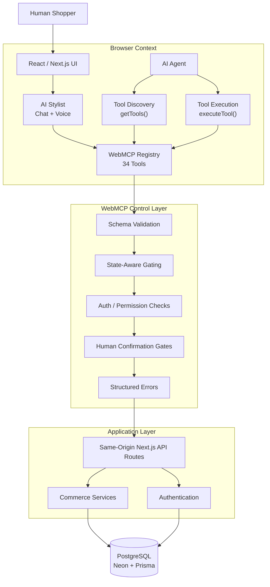
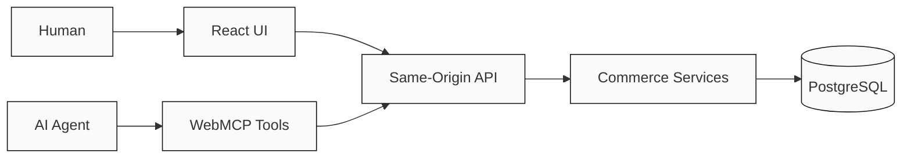
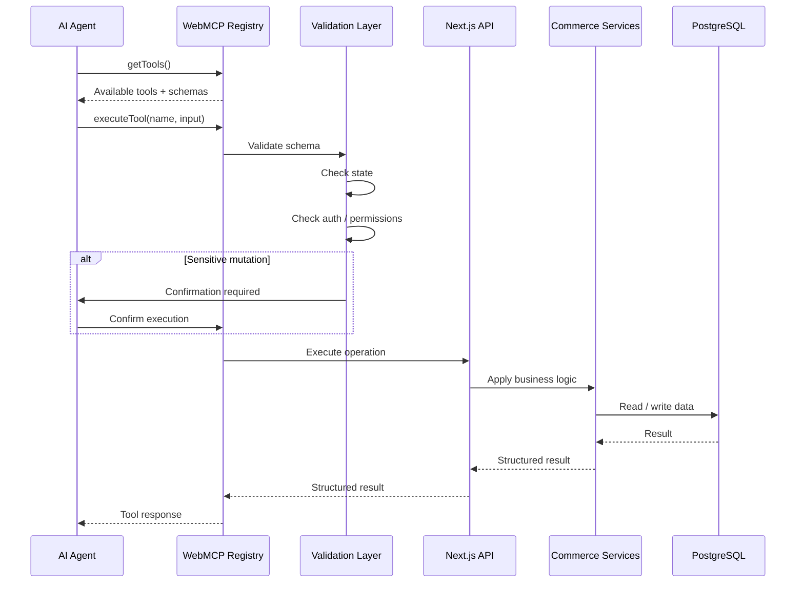
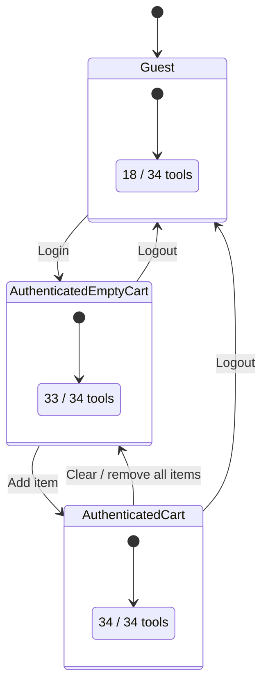
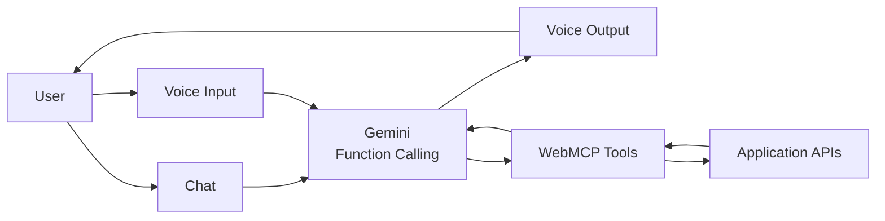

# Agent-Atelier — WebMCP-Powered Luxury Fashion E-Commerce

> **What if an AI agent could actually use a website?**

Agent-Atelier is a full-stack luxury fashion e-commerce experiment exploring what happens when a website exposes its capabilities directly to AI agents through **WebMCP**.

Instead of an agent only reading a page, interpreting the DOM, and clicking buttons, the website exposes structured tools that an agent can **discover, understand, and execute**.

The storefront is the demo environment. The real experiment is the architecture underneath it:

**Website → exposes capabilities → Agent discovers them → Agent executes them → Website enforces the rules**

This project is intentionally experimental. I'm exploring what an **agent-native web** could look like, rather than claiming to have solved it.

---

## Table of Contents

* [Project Overview](#project-overview)
* [Architecture](#architecture)
* [Why This Experiment](#why-this-experiment)
* [What Is WebMCP?](#what-is-webmcp)
* [Core Idea](#core-idea)
* [Agent Execution Flow](#agent-execution-flow)
* [WebMCP Tool System](#webmcp-tool-system)
* [State-Aware Tool Exposure](#state-aware-tool-exposure)
* [Schema Validation and Tool Contracts](#schema-validation-and-tool-contracts)
* [Commerce Experience](#commerce-experience)
* [Product Comparison](#product-comparison)
* [AI Stylist and Voice](#ai-stylist-and-voice)
* [Example Agent Journeys](#example-agent-journeys)
* [Security and Safety](#security-and-safety)
* [Testing](#testing)
* [LLM Evaluation](#llm-evaluation)
* [Browser Verification](#browser-verification)
* [Technology Stack](#technology-stack)
* [Project Structure](#project-structure)
* [Getting Started](#getting-started)
* [Running the Application](#running-the-application)
* [Testing and Evaluation Commands](#testing-and-evaluation-commands)
* [Environment Variables](#environment-variables)
* [Architectural Decisions](#architectural-decisions)
* [Limitations](#limitations)
* [References](#references)
* [License](#license)

---

## Project Overview

Agent-Atelier is a luxury fashion storefront built with Next.js and PostgreSQL, with browser-native WebMCP capabilities exposed through:

```ts
document.modelContext
```

The application currently exposes **34 WebMCP tools** covering areas such as:

* Product discovery
* Product filtering
* Product comparison
* Size guidance
* Stock inspection
* Cart management
* Wishlist management
* Authentication
* Orders
* Shipping
* Navigation

The tools are designed to be:

* Structured
* Schema validated
* State aware
* Permission aware
* Server authoritative
* Composable into multi-step workflows

The important architectural decision is that **WebMCP is not a separate commerce implementation**.

The AI agent and the React UI ultimately use the same application APIs, services, business rules, authentication, and database.

---

## Architecture

### System Architecture



### One Business Logic Path

The core architectural idea is simple:



WebMCP does **not** bypass the application's normal business logic.

Both paths converge on the same server-side behavior:

```text
Human
  │
  ▼
React UI
  │
  ├──────────────┐
  │              │
  ▼              ▼
API Routes    WebMCP Tools
  │              │
  └──────┬───────┘
         ▼
   Commerce Services
         │
         ▼
     PostgreSQL
```

This means things like authentication, ownership checks, stock validation, cart rules, and order rules are still enforced by the application.

---

## Why This Experiment

Traditional browser agents generally interact with websites through what they can observe:

```text
DOM
 ↓
Text
 ↓
Buttons
 ↓
Forms
 ↓
Clicks
```

That can work, but it becomes increasingly fragile when an agent needs to perform structured operations.

For example:

```text
Find "Add to Cart" button
        ↓
Figure out which product it belongs to
        ↓
Figure out the selected variant
        ↓
Figure out the quantity
        ↓
Click it
        ↓
Read the resulting page
```

Compared with:

```text
add_to_cart({
  productId,
  quantity,
  variant
})
```

The second approach gives the agent an explicit contract.

Instead of inferring capabilities from the presentation layer, the website can describe what it can actually do.

That is the rabbit hole this project explores.

---

## What Is WebMCP?

WebMCP is an emerging browser API for exposing website capabilities to AI agents through structured tools.

In this project, tools are exposed through:

```ts
document.modelContext
```

Agents can discover the available tools:

```ts
const tools = document.modelContext.getTools()
```

and execute them:

```ts
const result = await document.modelContext.executeTool(
  "search_products",
  {
    query: "blue silk blouse"
  }
)
```

Conceptually:

```text
             Website
                │
       ┌────────┴────────┐
       │                 │
   Capabilities        Schemas
       │                 │
       └────────┬────────┘
                ▼
            AI Agent
                │
                ▼
         Structured Action
                │
                ▼
             Website
```

The website can therefore expose capabilities such as:

```text
search_products
compare_products
check_stock
add_to_cart
view_cart
create_order
```

instead of forcing the agent to infer everything from visual UI.

> WebMCP is still experimental and browser-dependent. The implementation in this project should be considered an exploration rather than a production-ready pattern.

---

## Core Idea

The project is built around four questions:

### 1. What should an agent be allowed to see?

Not every capability should necessarily be available to every visitor.

A guest should not receive the same tool surface as an authenticated customer.

---

### 2. How should capabilities change with state?

Tool availability can depend on:

* Authentication
* Cart state
* Resource ownership
* Application state

The tool registry therefore changes dynamically.

---

### 3. When should a human have to confirm something?

Reading product information is one thing.

Creating an order is another.

The project experiments with confirmation gates for sensitive mutations.

---

### 4. How should agents chain multiple actions?

Real shopping tasks are rarely one tool call.

A request such as:

> "Find a black jacket in my size under $500, compare the best options, add my favorite to the cart, and check out."

may require multiple dependent operations.

That makes tool composition and state management important parts of the experiment.

---

## Agent Execution Flow

The high-level execution flow looks like this:



### Step-by-step

1. The website loads.
2. WebMCP tools are registered.
3. The agent calls `getTools()`.
4. The registry exposes the tools currently available to that user/state.
5. The agent selects a tool.
6. Input is validated against its schema.
7. Authentication and state requirements are checked.
8. Sensitive operations may require human confirmation.
9. The corresponding application API executes.
10. Server-side business rules run.
11. PostgreSQL is read or updated.
12. A structured result is returned to the agent.
13. The UI reflects the resulting state.

---

## WebMCP Tool System

Agent-Atelier exposes **34 tools** across several categories.

| Category          | Example Tools                                     | Purpose                     |
| ----------------- | ------------------------------------------------- | --------------------------- |
| Navigation        | `navigate_to`, `go_back`                          | Move around the storefront  |
| Product Discovery | `search_products`, `get_product`                  | Find product information    |
| Filtering         | `filter_products`, `get_size_guide`               | Narrow product selections   |
| Comparison        | `compare_products`                                | Compare multiple products   |
| Inventory         | `check_stock`                                     | Inspect availability        |
| Authentication    | `login`, `logout`, `get_auth_status`              | Manage sessions             |
| Cart              | `add_to_cart`, `remove_from_cart`, `view_cart`    | Manage shopping cart        |
| Wishlist          | `add_to_wishlist`, `remove_from_wishlist`         | Manage saved products       |
| Orders            | `create_order`, `get_orders`, `cancel_order`      | Manage orders               |
| Shipping          | `get_shipping_address`, `update_shipping_address` | Manage delivery information |

The exact registry contains **34 tools**, divided into public and authenticated capabilities.

---

## State-Aware Tool Exposure

One of the main experiments is making the tool surface depend on application state.



### Current exposure model

| User State                     | Available Tools |
| ------------------------------ | --------------: |
| Guest                          |         18 / 34 |
| Authenticated + Empty Cart     |         33 / 34 |
| Authenticated + Populated Cart |         34 / 34 |

The idea is that **tool availability becomes part of application state**.

For example:

```text
Guest
 ↓
No authenticated mutations

Login
 ↓
Account capabilities become available

Add product
 ↓
Cart-dependent capabilities become available
```

This avoids exposing operations that cannot meaningfully execute in the current state.

---

## Schema Validation and Tool Contracts

Every tool has a structured contract.

A simplified example:

```ts
{
  name: "add_to_cart",
  description: "Add a product variant to the authenticated user's cart",
  inputSchema: {
    type: "object",
    properties: {
      productId: {
        type: "string"
      },
      quantity: {
        type: "number",
        minimum: 1
      }
    },
    required: ["productId", "quantity"]
  }
}
```

The registry validates inputs before execution.

```text
Agent Input
    │
    ▼
Schema Validation
    │
    ├── Invalid ──► Structured Error
    │
    ▼
State Check
    │
    ├── Not Allowed ──► Structured Error
    │
    ▼
Auth / Ownership Check
    │
    ├── Unauthorized ──► Structured Error
    │
    ▼
Business Logic
```

This provides a stronger boundary than simply trusting model-generated arguments.

---

## Commerce Experience

The storefront is intentionally designed as a realistic enough environment for agent experimentation.

### Product Catalog

The current catalog contains **62 pieces**:

| Collection       |  Items |
| ---------------- | -----: |
| Women's Tops     |     31 |
| Men's T-Shirts   |     23 |
| Denim & Trousers |      8 |
| **Total**        | **62** |

The catalog supports structured product discovery, filtering, variants, sizes, and stock inspection.

---

### Authentication

Authentication uses:

* JWT
* `jose`
* HTTP-only cookies
* Server-side session validation

Authenticated WebMCP tools are only exposed when the required session state exists.

---

### Cart

Agents can perform operations such as:

```text
View cart
Add product
Update quantity
Remove product
Clear cart
```

Cart mutations operate against the same cart state used by the React storefront.

---

### Wishlist

The wishlist allows agents to save and remove products for authenticated users.

Resource ownership is enforced server-side.

---

### Orders

The project includes a demo order workflow.

The agent can:

```text
Inspect cart
   ↓
Confirm order details
   ↓
Create order
   ↓
Receive structured result
```

Sensitive order creation is protected by a human confirmation gate.

> This is a **demo checkout flow**. No production payment processor is connected.

---

### Shipping

Authenticated users can inspect and update shipping information through structured tools.

Because shipping information can contain personal data, access is restricted to the authenticated user's own resources.

---

## Product Comparison

Product comparison is designed to work differently depending on the number of products being compared.

### Small comparisons

For 2–3 products, the agent can compare products in parallel.

```text
Product A ──┐
Product B ──┼──► Comparison
Product C ──┘
```

### Larger comparisons

For 4+ products, comparisons can be processed serially to avoid unnecessary complexity and context pressure.

```text
Product A
   ↓
Product B
   ↓
Product C
   ↓
Product D
   ↓
Comparison
```

The goal is to let the agent reason over structured product information rather than repeatedly navigating the storefront.

---

## AI Stylist and Voice

Agent-Atelier also includes an AI Stylist interface.

It supports:

* Text chat
* Voice input
* Voice output
* Product discovery
* Product recommendations
* Tool execution

The important design decision is that **chat and voice use the same WebMCP capabilities**.



This means the interface can change without creating a second tool architecture.

---

## Example Agent Journeys

### Journey 1 — Product Discovery

```text
User:
"Find me a black top under $300."

        ↓

search_products
        ↓
filter_products
        ↓
check_stock
        ↓
Structured results
        ↓
Agent recommendation
```

---

### Journey 2 — Compare Products

```text
User:
"Compare these three pieces."

        ↓

get_product
get_product
get_product

        ↓

compare_products

        ↓

Structured comparison
```

---

### Journey 3 — Add to Cart

```text
User:
"Add the medium one to my cart."

        ↓

Identify product
        ↓
Check variant
        ↓
Check stock
        ↓
add_to_cart
        ↓
Updated cart state
```

---

### Journey 4 — Multi-Step Shopping

A more complex request might look like:

```text
"Find a black jacket in my size,
compare the best options,
add my favorite to the cart,
and check out."
```

Potential tool chain:

```text
search_products
      ↓
filter_products
      ↓
get_size_guide
      ↓
check_stock
      ↓
compare_products
      ↓
add_to_cart
      ↓
view_cart
      ↓
create_order
```

The interesting part is not any individual tool.

It is the ability to **compose capabilities into a larger task**.

---

## Security and Safety

Agent access should not mean unrestricted access.

The project therefore applies multiple layers of protection.

### Authentication Isolation

Authenticated tools are only available when the required session exists.

```text
Guest
 ↓
Public tools

Authenticated
 ↓
Protected tools
```

---

### Resource Ownership

User-owned resources are checked server-side.

Examples:

* Cart
* Wishlist
* Orders
* Shipping information

An agent cannot simply provide another user's identifier and access their resources.

---

### Human Confirmation

Sensitive mutations require explicit human confirmation.

Current confirmation-gated operations include:

```text
create_order
cancel_order
clear_cart
logout
update_shipping_address
remove_from_cart
```

The idea is to separate:

```text
Read / Explore
```

from:

```text
Meaningful / Destructive Mutation
```

---

### PII Redaction

Sensitive personal information is treated carefully in tool responses and logging.

The goal is to minimize unnecessary exposure of personal data to the model and development tooling.

---

### Prompt Injection Defense

Tool descriptions and execution boundaries are designed with prompt-injection risks in mind.

The model is not treated as a trusted authority.

The server remains responsible for:

* Authentication
* Authorization
* Validation
* Ownership
* Business rules
* Mutation safety

---

### Audit Logging

Important agent operations can be logged for debugging and evaluation.

This helps answer:

```text
What did the agent try to do?
What tool did it call?
What input did it provide?
What happened?
Why did the operation fail?
```

---

## Testing

Testing is split across several layers.

### Deterministic Tests

The project includes **90 deterministic tests** covering application and WebMCP behavior.

These focus on predictable logic such as:

* Tool registration
* Tool schemas
* Validation
* Authentication
* State transitions
* Commerce operations
* Error handling

---

### Integration Tests

There are **23 integration tests** covering interactions between application components.

---

### Browser E2E

There are **7 Playwright browser specifications** covering real browser behavior.

These help verify that the WebMCP layer works in the environment where the agent actually interacts with the application.

---

### Build Verification

The production build is also verified as part of the validation process.

---

## LLM Evaluation

Because the project is specifically about agent behavior, traditional unit tests are not enough.

The repository also contains **16 LLM evaluation cases**.

These evaluate things such as:

* Tool selection
* Argument generation
* Multi-step execution
* Failure recovery
* State awareness
* Confirmation behavior

The purpose is not simply:

> "Does the function work?"

but also:

> "Can an agent correctly understand when and how to use the function?"

---

## Browser Verification

WebMCP behavior was manually verified using Chrome's **Model Context Tool Inspector**.

The verification includes:

* Tool discovery
* Tool schemas
* Tool availability
* State-dependent exposure
* Tool execution
* Structured responses

The application also verifies relevant browser headers:

```text
Origin-Agent-Cluster: ?1
Permissions-Policy: tools=(self)
```

These are part of the browser-side WebMCP setup used by the project.

---

## Technology Stack

### Frontend

* Next.js 14
* React 18
* TypeScript 5
* Vanilla CSS

### Backend

* Next.js App Router
* API Routes
* Node.js 20
* PostgreSQL
* Prisma 5
* Neon

### Authentication

* JWT
* `jose`
* HTTP-only cookies

### AI

* Gemini
* `gemini-2.0-flash`
* Function calling
* AI Stylist
* Web Speech API

### Agent Interface

* Native browser WebMCP
* `document.modelContext`
* Structured tool schemas
* State-aware tool registry

### Testing

* Vitest
* Playwright
* LLM evaluation suite

### Deployment

* Netlify
* Node.js 20

---

## Project Structure

A simplified structure:

```text
Agent-Atelier/
│
├── src/
│   ├── app/
│   │   ├── api/
│   │   │   ├── auth/
│   │   │   ├── products/
│   │   │   ├── cart/
│   │   │   ├── wishlist/
│   │   │   ├── orders/
│   │   │   └── shipping/
│   │   │
│   │   ├── shop/
│   │   ├── cart/
│   │   ├── wishlist/
│   │   ├── orders/
│   │   └── ...
│   │
│   ├── components/
│   ├── lib/
│   │   ├── auth/
│   │   ├── db/
│   │   ├── commerce/
│   │   └── webmcp/
│   │
│   └── ...
│
├── prisma/
│   ├── schema.prisma
│   └── ...
│
├── tests/
│   ├── unit/
│   ├── integration/
│   ├── e2e/
│   └── evals/
│
├── docs/
│   ├── architecture/
│   ├── testing/
│   ├── evaluation/
│   ├── decisions/
│   └── webmcp/
│
├── public/
├── package.json
├── next.config.js
├── playwright.config.ts
├── vitest.config.ts
└── README.md
```

The exact directory structure may evolve as the experiment develops.

---

## Getting Started

### Prerequisites

Make sure you have:

* Node.js 20+
* npm
* PostgreSQL database
* Neon account or another PostgreSQL provider
* Gemini API key
* A browser/runtime with WebMCP support for the agent-facing experience

---

### Clone the Repository

```bash
git clone https://github.com/misbah7172/AgentBridge--WebMCP-Powered-E-Commerce-Platform.git
cd AgentBridge--WebMCP-Powered-E-Commerce-Platform
```

---

### Install Dependencies

```bash
npm install
```

---

### Configure Environment Variables

Create:

```text
.env.local
```

and add the required environment variables.

See [Environment Variables](#environment-variables).

---

### Setup Database

Run Prisma migrations:

```bash
npx prisma migrate dev
```

Generate the Prisma client:

```bash
npx prisma generate
```

If the project contains seed data:

```bash
npm run seed
```

---

## Running the Application

Start the development server:

```bash
npm run dev
```

Then open the application in your browser.

The normal storefront can be used through the React UI.

For the agent experience, use a browser/runtime that supports WebMCP and inspect the registered tools through the browser's available model-context tooling.

---

## Testing and Evaluation Commands

### Unit / Deterministic Tests

```bash
npm test
```

### Watch Mode

```bash
npm run test:watch
```

### Integration Tests

```bash
npm run test:integration
```

### Playwright

```bash
npx playwright test
```

### Playwright UI

```bash
npx playwright test --ui
```

### Build

```bash
npm run build
```

### LLM Evaluation

Use the project's configured evaluation command:

```bash
npm run eval
```

> Test counts and scripts should be kept synchronized with the repository as the experiment evolves.

---

## Environment Variables

The application expects environment-specific configuration similar to:

```env
DATABASE_URL=

JWT_SECRET=

GEMINI_API_KEY=

WEBMCP_EVAL_MODEL=
```

Depending on the current deployment configuration, additional variables may be required.

Never commit real secrets to the repository.

For local development, use `.env.local`.

---

## Architectural Decisions

### ADR 1 — WebMCP Instead of a Separate Agent API

The experiment intentionally exposes capabilities through the browser rather than creating a completely separate agent-facing backend.

**Reason:**

The website itself should describe and expose its capabilities.

---

### ADR 2 — Same Business Logic for UI and Agents

The React UI and WebMCP tools converge on the same application APIs and commerce services.

**Reason:**

This avoids creating two independent implementations of:

* Cart rules
* Authentication
* Product logic
* Orders
* Shipping
* Permissions

---

### ADR 3 — State-Aware Tool Registry

Tools are exposed based on the current application state.

**Reason:**

An agent should not be given capabilities that cannot currently execute.

---

### ADR 4 — Human Confirmation for Sensitive Mutations

Important mutations require explicit confirmation.

**Reason:**

Agent autonomy should not automatically mean unrestricted authority.

---

### ADR 5 — Structured Errors

Tools return structured failures instead of relying on the model to interpret arbitrary UI errors.

**Reason:**

Agents need machine-readable feedback to recover or choose another action.

---

### ADR 6 — Tool Contracts Are First-Class

Each tool has an explicit input schema and execution contract.

**Reason:**

The agent should understand the capability before attempting to use it.

---

## Limitations

This project is an experiment, and there are several important limitations.

### WebMCP Availability

Browser support for WebMCP is still evolving.

The application may not provide the same agent experience in every browser.

---

### Experimental API Surface

WebMCP APIs and conventions may change as the ecosystem develops.

Some implementation decisions may therefore need to change.

---

### Demo Checkout

The checkout flow is for demonstration.

There is currently no production payment processor.

---

### Agent Reliability

Even with structured tools, LLMs can:

* Choose the wrong tool
* Generate incorrect arguments
* Misunderstand user intent
* Chain actions incorrectly
* Fail to recover from unexpected results

Structured tools reduce ambiguity, but they do not eliminate model errors.

---

### Security Is Defense-in-Depth

WebMCP should never be treated as an authorization mechanism by itself.

The server must continue enforcing:

```text
Authentication
Authorization
Ownership
Validation
Business Rules
Mutation Safety
```

---

### Experimental Architecture

The architecture is optimized for learning and experimentation rather than production scale.

There are still open questions around:

* Tool granularity
* Capability discovery
* Permission models
* Agent memory
* Confirmation UX
* Long-running workflows
* Error recovery
* Tool versioning
* Observability
* Cross-site agent interaction

---

## References

Useful areas to explore when working with this project:

* WebMCP
* Model Context Protocol
* Chrome browser AI / agent capabilities
* Next.js App Router
* Prisma
* Neon PostgreSQL
* Gemini function calling
* Playwright
* Vitest
* Web Speech API

---

## License

This project is available under the license included in the repository.

---

## Project Status

**Experimental / Actively Exploring**

Agent-Atelier is not intended to be a final answer to agent-native web architecture.

It's a working experiment around a simple question:

> **What if websites didn't just present information to AI agents, but exposed what they can actually do?**

There are still a lot of things I don't have figured out.

That's kind of the point.

The interesting questions now are less about making an agent click a button and more about:

```text
What should a website expose?
What should an agent be allowed to do?
How should capabilities change with state?
When should a human take control?
How should agents recover from failure?
How do multiple tools become a reliable workflow?
```

Agent-Atelier is my attempt to explore some of those questions in code.

---