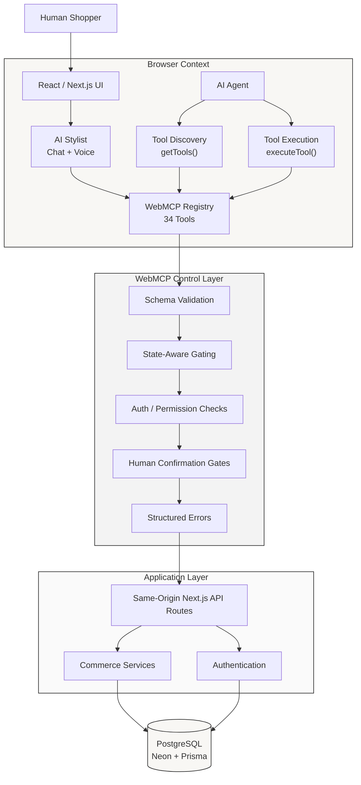
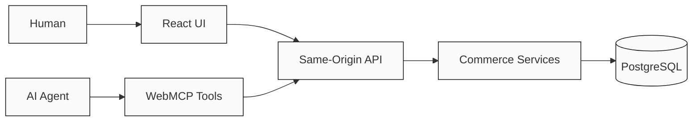

# Agent-Atelier — WebMCP-Powered Agent-Native Commerce

> **What happens when a website can expose its own capabilities directly to an AI agent?**

**Agent-Atelier** is a full-stack luxury fashion e-commerce experiment built to explore that question.

Instead of asking an AI agent to visually interpret a website and click through its UI, Agent-Atelier exposes **34 structured, schema-validated WebMCP tools** through the browser.

An agent can discover what the website can do, understand the available capabilities, and execute actions such as searching products, comparing garments, checking stock, managing a cart, navigating pages, and completing multi-step shopping flows.

The same underlying commerce logic powers both the human UI and the agent interface.

This project is intentionally experimental. The goal is not to present a finished solution to agent-native web interaction, but to explore what becomes possible when **the website itself becomes an interface for AI agents.**

---

## Architecture at a Glance



### The important architectural idea

There are **two entry points**, but only one business logic path:



This means WebMCP is **not a parallel commerce implementation**.

The agent-facing tools ultimately use the same:

* API routes
* Authentication
* Authorization
* Commerce services
* Database
* Business rules

as the normal React application.

---

## 1. Project Overview

Agent-Atelier is a **Next.js 14 luxury fashion storefront** backed by PostgreSQL and Prisma, with browser-native WebMCP capabilities exposed directly through:

```ts
document.modelContext
```

The application currently exposes **34 WebMCP tools** covering:

* Product discovery
* Apparel filtering
* Product comparison
* Size guidance
* Stock inspection
* Cart management
* Wishlist management
* Authentication
* Orders
* Shipping
* Navigation

The tools are:

* Structured
* Schema validated
* State aware
* Permission aware
* Server-authoritative
* Designed for multi-step agent workflows

The important architectural decision is that **WebMCP is not a second application layer**.

The agent and the React UI ultimately use the same commerce APIs and service logic.

```text
Human ──────► React UI ──────┐
                             ├──► API ──► Services ──► Database
AI Agent ───► WebMCP ────────┘
```

---

## 2. Why This Experiment

Traditional web agents generally have to infer what a website can do from:

* DOM structure
* Visible text
* Buttons
* Forms
* Page layout
* Screenshots

That works reasonably well for simple navigation, but becomes fragile when the agent needs to perform operations involving:

* Authentication
* User-owned resources
* Product identifiers
* Stock validation
* Cart state
* Order state
* Multi-step workflows
* Sensitive mutations

For example, visually finding an **"Add to Cart"** button is different from having a structured operation such as:

```text
add_to_cart({
  productId,
  quantity,
  variant
})
```

The second approach gives the agent a defined contract instead of forcing it to infer the application's internal behavior from presentation.

Agent-Atelier explores what happens when those capabilities are explicitly exposed by the website.

---

## 3. What Is WebMCP?

**WebMCP (Web Model Context Protocol)** is an emerging browser API that allows websites to expose structured tools to AI agents operating within the browser.

In Agent-Atelier, tools are registered through:

```ts
document.modelContext
```

An agent can discover tools and their schemas:

```ts
document.modelContext.getTools()
```

and execute them:

```ts
document.modelContext.executeTool(
  "search_products",
  {
    query: "blue silk blouse"
  }
)
```

Conceptually:

```text
Website
   │
   ├── describes its capabilities
   ├── exposes schemas
   ├── controls availability
   └── executes validated operations
             ▲
             │
          AI Agent
```

This is different from a traditional remote MCP server.

The tools are exposed by the **active website inside the browser context**, allowing the application to apply its own session, state, permissions, and security boundaries.

> WebMCP support is currently experimental and browser-dependent. See [Limitations](#25-limitations).